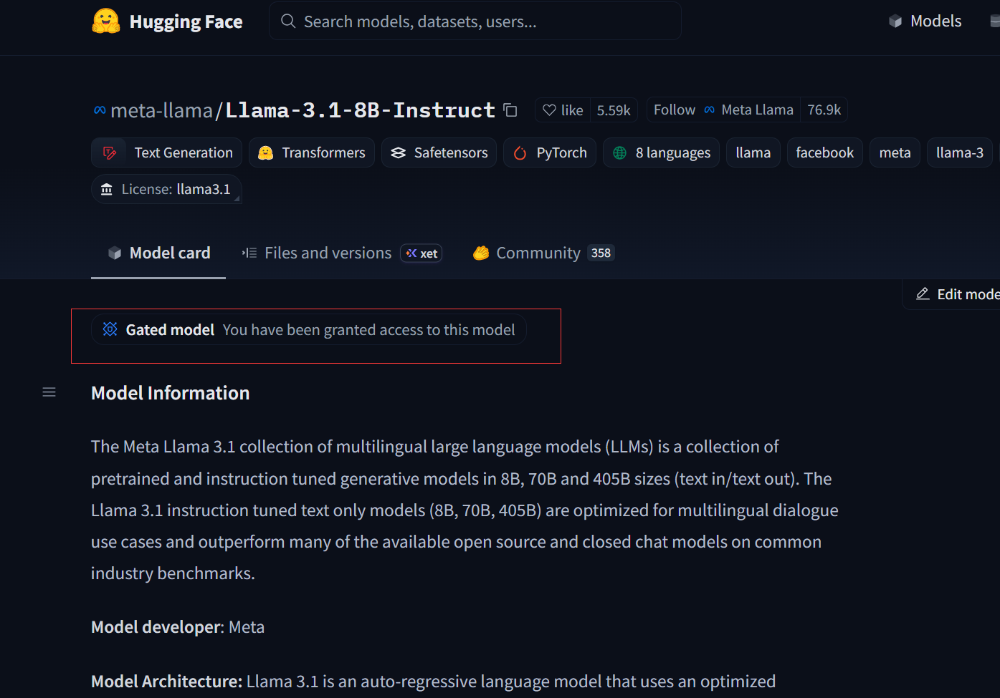
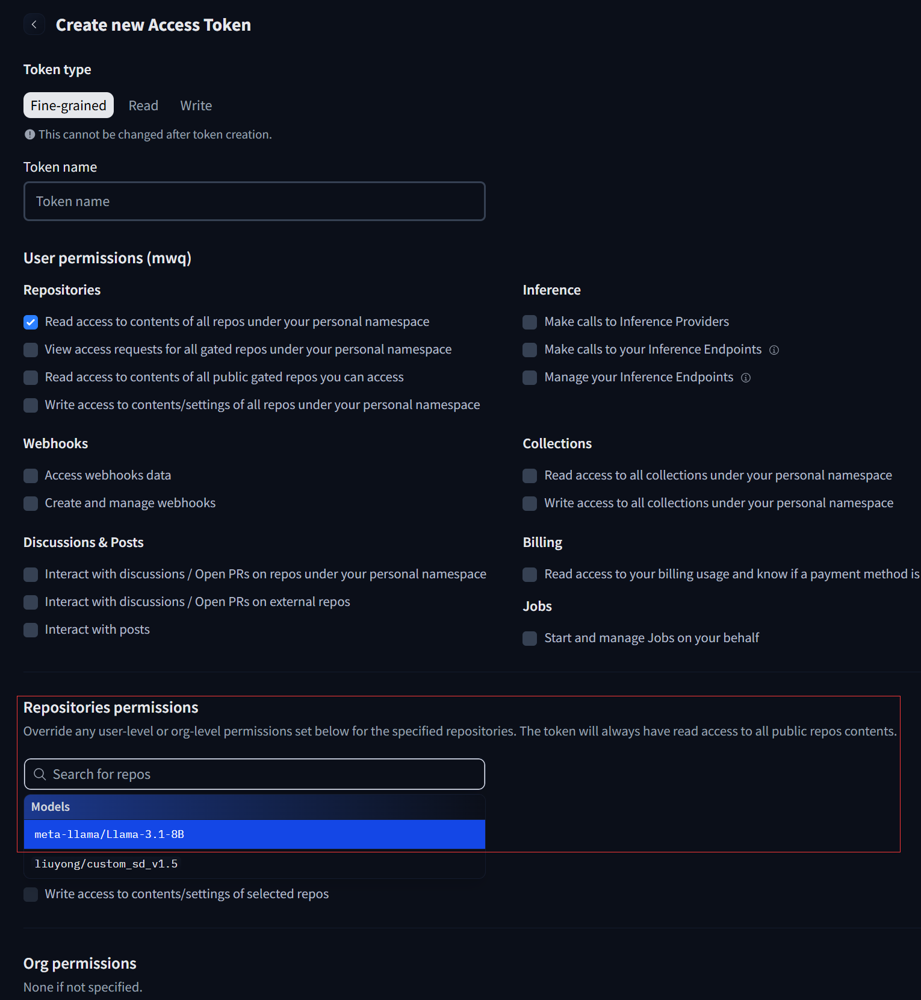

这一部分需要用到 Llama-3.1-8B 的模型，最好使用[huggingface](https://huggingface.co/meta-llama/Llama-3.1-8B-Instruct)上的途径。
具体要先申请，拿到获取模型的权限。

在配置huggingface的token上设置可以访问这个模型

之后在终端huggingface登录时(hf login)，使用这个token,就有权限下载了。
